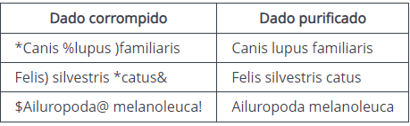

# Purificação

Você e seus amigos estavam fazendo um projeto da faculdade e encontraram um banco de dados com nomes científicos de animais que poderia ajudá-los, porém os dados estavam corrompidos.

O seu dever é criar um script para purificar esses dados e utilizá-los em seu trabalho.

A purificação consiste em retirar os caracteres especiais contidos no nome como exemplificado abaixo:



> Formato da entrada

A entrada será sempre uma string representando um nome corrompido com alguns dos seguintes caracteres !@#$%&*().

> Formato da saída

A saída deverá ser sempre uma string representando o nome purificado sem os seguinte caracteres especiais !@#$%&*().

> Exemplo de entrada

````*Canis %lupus )familiaris````

> Entrada de saída

```Canis lupus familiaris```